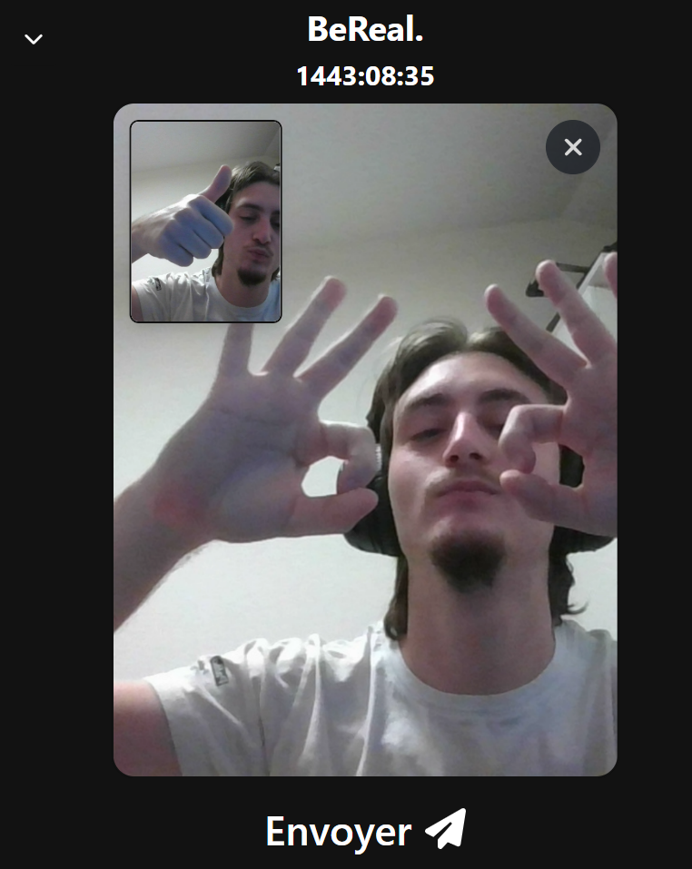

# HEIG-VD_DevMobil_REST

Front end for the REST API project of the DévMobil and ArchiOWeb courses at HEIG-VD.

The backend code for this project can be found at [HEIG-COMEM/HEIG-VD_ArchiOWeb_REST](https://github.com/HEIG-COMEM/HEIG-VD_ArchiOWeb_REST)

## Introduction

This project involves a partial recoding of the BeReal application, a social platform that prioritizes authenticity. BeReal prompts users to share unfiltered, genuine photos at a random time each day. Its standout feature is the inability to retouch photos or apply filters.

The goal of this project is to replicate some of BeReal's core features to gain a deeper understanding of its structure and functionality, laying the groundwork for developing a complete version.

## Application Features

### 1. Login

Users can log into the application by entering their credentials (email and password) to access their data and news feed.

### 2. Account Creation

New users can register by creating an account to recover their data from any device.

### 3. Notifications

#### 3.1. Admin Notifications

If connected as an admin user, you can send a notification to all users once a day.
This notification will be displayed on the user's device as a push notification (trough OneSignal).

#### 3.2. User Notifications

The application features a **WebSocket notifications** system that sends real-time notifications to users when they receive a friend request, someone accepts their friend request, or someone comments on their post.

### 4. Dual Photo Capture

When users open the app after receiving the notification, both the front and rear cameras activate simultaneously to capture two photos:

- **Main Photo (Rear Camera)**: Shows what the user is doing.

- **Selfie (Front Camera)**: Shows the user's reaction.

The publication also captures the user's location.

### 5. News Feed with Infinite Scroll

The news feed displays the posts of a user's friends, updated dynamically through infinite scrolling. This feature ensures seamless navigation by continuously loading new posts as the user scrolls down, eliminating the need for manual page transitions.
Posts are visible only if the user has also shared a photo on the same day.

### 6. Comments

- Users can comment on their friends' posts and reply to comments.

### 7. Friendship System

- **Add Friends**: Users can send friend requests to other users.

- **Accept/Decline Friend Requests**: Users can accept or decline friend requests. _A friend request must be accepted by the recipient to establish a friendship._

- **Search for Friends**: A search feature allows users to find others in the app using their pseudonyms.
- **Remove Friends**: Users can remove someone from their friends list.

### 8. User Profile

Each user has a public profile containing the following information:

- **Profile Picture (PP)**: An image representing the user.
- **Pseudonym**: A nickname chosen by each user when creating their account.
- **Last Three BeReals**: The user's last three posts are visible on their profile, allowing others to see their recent activity. _Only available if the viewing user is friends with the profile owner. Otherwise, a "add friend" button is displayed._

## Authors

This project was carried out by:

- **[Jérémie Zurflüh]**: Frontend / Backend Developer
- **[Jérémy Martin]**: Frontend / Backend Developer
- **[Antoine Uldry]**: Frontend Developer / Backend Developer
- **[Steve Pasche]**: UX/UI Designer

---

Thank you for exploring our BeReal recoding project!
